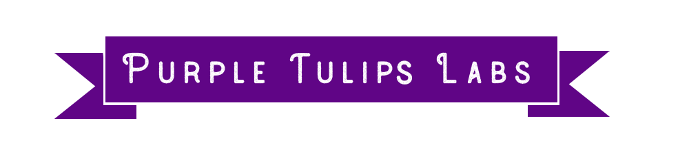

<html>

<head>
    <meta charset="utf-8">
    <meta http-equiv="X-UA-Compatible" content="IE=edge">
    <link rel="icon" href="./images/logo mio.png">
    <title>Purple Tulips Labs</title>
    <meta name="viewport" content="width=device-width, initial-scale=1">

    <link href='https://fonts.googleapis.com/css?family=Roboto:400,100,300,700,900' rel='stylesheet' type='text/css'>
    <link href="https://fonts.googleapis.com/css?family=Roboto+Slab:300,400,700" rel="stylesheet">
    <link rel="stylesheet" href="css/animate.css">
    <link rel="stylesheet" href="css/icomoon.css">
    <link rel="stylesheet" href="css/bootstrap.css">
    <link rel="stylesheet" href="css/superfish.css">
    <link rel="stylesheet" href="css/flexslider.css">
    <link rel="stylesheet" href="css/style.css">

    

</head>

<body>

    <header id="fh5co-header" role="banner">
        

            

                
            

            <nav>
                <ul>
                    <li class="active"><a href="about.html">About</a></li>

                    <li><a href="contact.html">Contact</a></li>
                    <li><a href="https://www.instagram.com/purpletulipslabs/" target="_blank">Instagram</a></li>
                </ul>
            </nav>
        

    </header>

    

        <h1 class="mb0">About us</h1>
        
Graphic Design, Web Design

        
Purple Tulipan is an independent startup made up of computer science students and graphic designers, we work mainly on the creation of logos, advertising banners, slogans, web design and animations 

        

    

    <footer id="fh5co-footer" role="contentinfo">
        

            

                
<small>&copy; 2019 Present. All Rights Reserved.  Designed by <a href="https://www.instagram.com/leo_iancu/?hl=it">Leo Iancu</a></small>

                

                    <a href="#"><i class="icon-"></i></a>
                    <a href="https://www.instagram.com/leo_iancu/?hl=it"><i class="icon-instagram2"></i></a>

                

            

        

    </footer>

    
    
    
    

</body>

</html>
